## Tujuan Pembelajaran
---
Setelah praktikum ini dilakukan Anda diharapkan dapat:

* Mampu bekerja dalam tim dengan git
* Mampu melakukan workflow git


### Persiapan Project
---
Sebelum bisa berkontribusi, terlebih dulu kita siapkan repository baik di remote maupun di lokal. Agar bisa menjalankan langkah-langkah berikut dengan baik, pastikan Anda sudah memiliki akun `Github` dan sudah menginstal aplikasi Git di laptop/PC. Cara-caranya sudah pernah saya jelaskan di [praktikum 0](/Modul%20Praktikum/0-Modul%20Git/Praktikum-0-Git-&-Github.md).

### Fork Repository
---
`Forking repository` artinya kita mengcopy repository project asal di akun pembuatnya ke akun kita. Ini biasanya dilakukan karena kita tidak punya akses untuk langsung membuat perubahan di repository asal. Jadi kita buat perubahan di akun sendiri untuk kemudian minta `developer pemilik repo pusat` untuk mengambil perubahan yang kita buat.

Pertama, silahkan anda check akun [yysofiyan](https://github.com/FT3109-PABWEB) *(silahkan cari repositori berdasarkan kelas anda)* kemuadian langkah selanjutnya adalah melakukan `fork repository` ke akun kita.

Silahkan buka proyek tersebut, lalu klik tombol **fork**


Setelah itu, dia akan membuat fork. Tunggu saja sebentar, kira-kira beberapa detik.

Hasilnya, kita akan memiliki copy dari repo tadi di akun kita sendiri.

### Clone Repository
---
Agar file-file bisa diedit, kita harus ambil dulu repository tersebut ke laptop/PC kita. Kita membutuhkan URL repository yang bisa didapatkan dengan cara menekan tombol hijau `Clone or Download.`

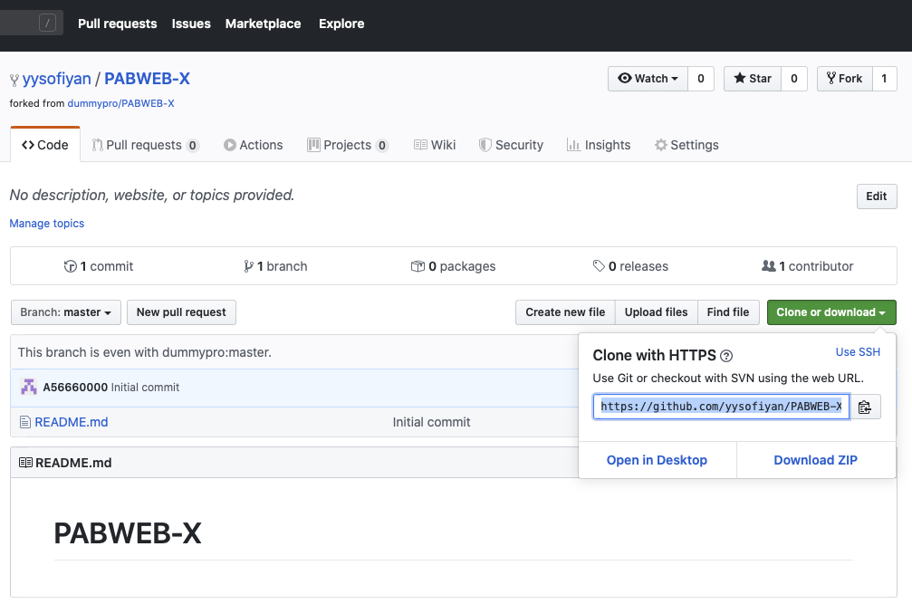

HTTPS:

```https
https://github.com/yysofiyan/PABWEB-X.git
```

SSH:

```ssh
git@github.com:yysofiyan/PABWEB-X.git
```
##### Note: Pastikan kita clone repository di akun kita sendiri, bukan di akun repository asal `(yysofiyan)`.

Buka `command prompt`, kemudian pindah ke folder yang diinginkan, lalu lakukan `git clone`.

```bash                                         
➜  ~ cd desktop/
➜  desktop git clone https://github.com/yysofiyan/PABWEB-X.git 

Cloning into 'PABWEB-X'...
remote: Enumerating objects: 31, done.
remote: Counting objects: 100% (31/31), done.
remote: Compressing objects: 100% (27/27), done.
remote: Total 31 (delta 3), reused 30 (delta 2), pack-reused 0
Unpacking objects: 100% (31/31), done.
➜  desktop 
```

Setelah perintah di atas dijalankan, harusnya di komputer kita akan ada folder baru sesuai nama repository, yaitu `PABWEB-X`. Jangan lupa untuk masuk / pindah ke folder tersebut sebelum menjalankan perintah-perintah berikutnya.

###### *(repositori berdasarkan kelas anda)*

### Membuat Topic Branch
---
Perintah untuk membuat cabang adalah `git branch`, kemudian diikuti dengan nama cabangnya.

**Contoh**:

```bash
git branch <NIM_ANDA>
git branch A5.123456
```
Maka Git akan membuat cabang bernama `A5.123456`

Untuk melihat cabang apa saja yang ada di repositori, gunakan perintah `git branch.`

**output**:

```bash
➜  PABWEB-X (master) ✔ git branch

A5.123456
* master
(END)
```
**Note: Tanda bintang `(*)` artinya cabang yang sedang aktif atau Kita sedang berada di sana.**

Pada repositori, buatlah sebuah cabang baru dengan nama NIM_ANDA

```git
git branch A5.123456
```
Setelah itu, pindah ke cabang yang baru saja kita buat dengan perintah:

```git
git checkout A5.123456
```
Outputnya seperti ini

```zsh
➜  PABWEB-X (master) ✔ git checkout A5.123456                         
Switched to branch 'A5.123456'
➜  PABWEB-X (A5.123456) ✔ git status
On branch A5.123456
nothing to commit, working tree clean
```
Selanjutnya silahkan buka dengan teks editor dan lakukan modifikasi.

Sebagai contoh, saya membukanya dengan `VS Code.`

Lalu pada `branch NIM` anda buat direktori dengan nama `NIM_ANDA` kemudian

di dalam direktori `NIM_ANDA` buat `sub direktori` dengan nama _**Praktikum_n**_.

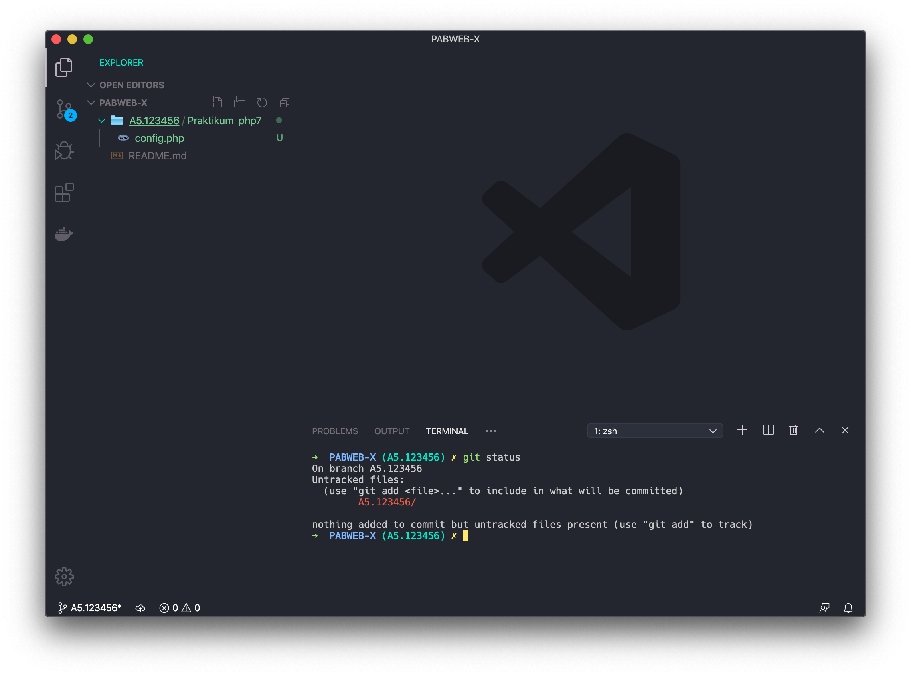


##### **Note**: Jangan lupa untuk menggunakan printah `git status `untuk melihat `status repositori.`

Kita sudah menambahkan `direktori A5.123456`. Selanjutnya kita lakukan `commit.`

```git
git add A5.123456
git commit -m "membuat direktori A5.123456"
```

Outputnya seperti ini

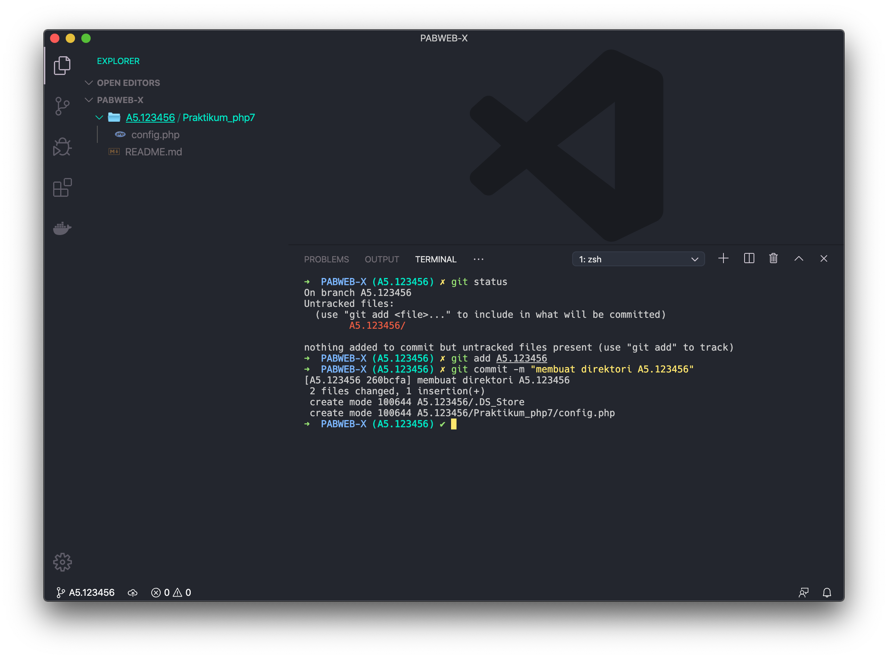

revisi kita pada cabang `A5.123456` sudah disimpan. Sekarang coba kembali ke `cabang master`.

```git
git checkout master
```

Apakah anda menemukan `direktori/sub direktori` dan `file A5.123456` ?

Pasti tidak!

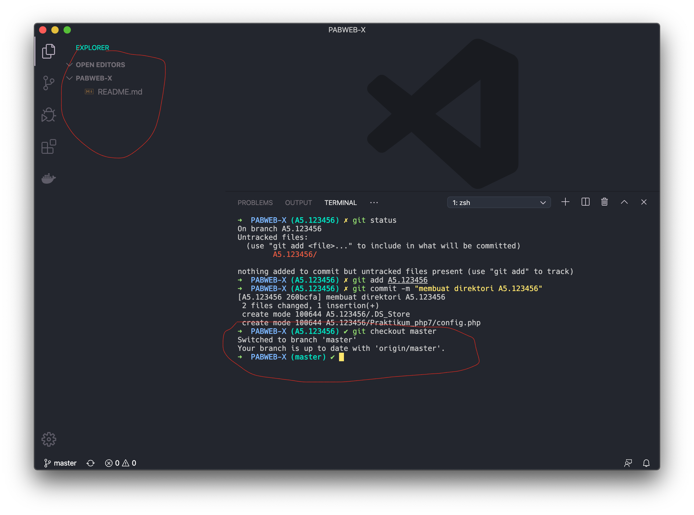

Sekarang kembali lagi ke cabang `A5.123456.`

```git
git checkout A5.123456
```

Kemudian Cek lagi, apakah sekarang `direktori/sub direktori dan file A5.123456` sudah ada?

Ternyata ada. kita bisa mengambil kesimpulan, kalau perubahan pada cabang `A5.123456` tidak akan berpengaruh di cabang `master.`

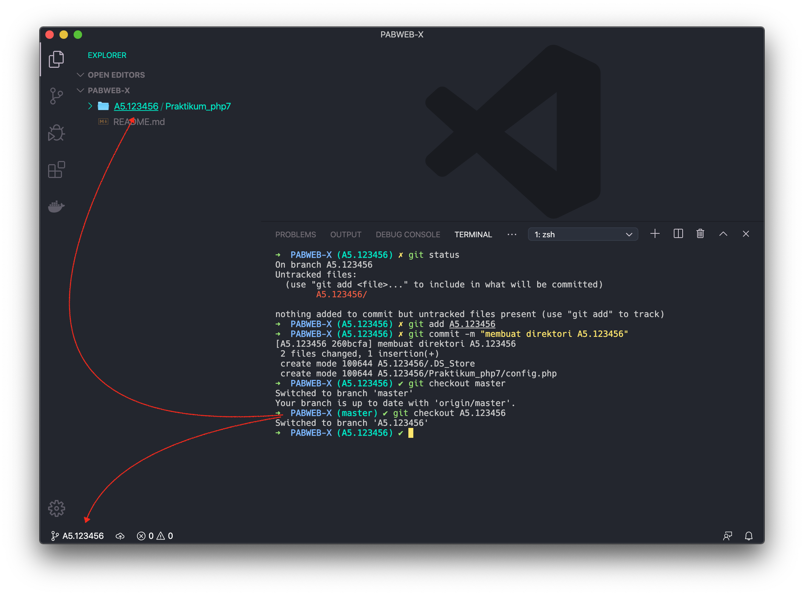

### Menggabungkan Cabang
---
Anggaplah kita sudah selesai membuat `direktori/sub direktori dan menambahkan file` di cabang `A5.123456` Sekarang kita ingin Menggabungkannya denga cabang `master (utama).`

Pertama, kita harus pindah dulu ke `cabang master.`

```git
git checkout master
```
Setelah itu, barulah kita bisa menggabungkan dengan perintah `git merge.`

```git
git merge A5.123456
```
Sekarang lihat, `direktori/sub direktori dan file A5.123456` sudah ada di `cabang master.`

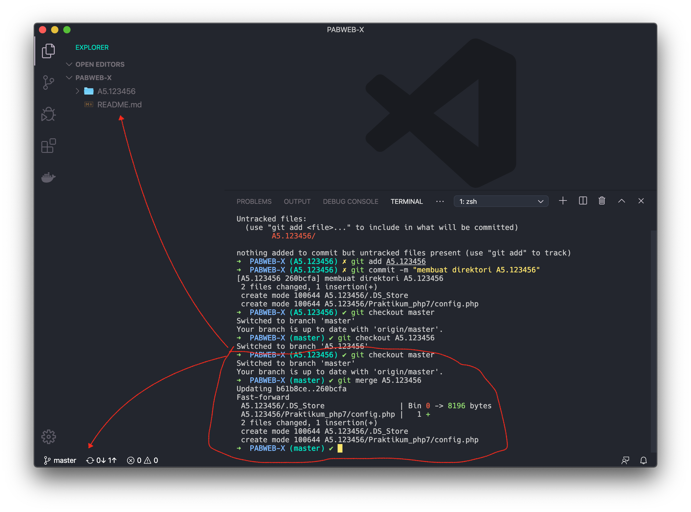

### Upload Perubahan
---
Berikutnya, kita upload perubahan ke `Github`, karena langkah sebelumnya cuma menyimpan di lokal saja

Repository yang kita *clone* dari Github, akan otomatis `membuat remote` bernama `origin.`

Untuk melihatnya, gunakan perintah

```git
git remote -v
```


Alamat tujuan *push* dan *fetch* mengarah ke alamat repository di akun kita.

Silahkan melakukan push dengan perintah berikut.

```git
git push
```
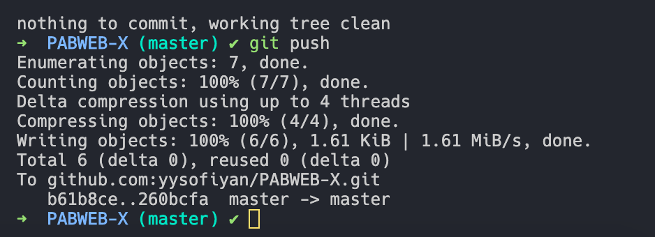

Setelah selesai, coba lihat repository di akun Github-mu.

Apakah berhasil di-push atau tidak?

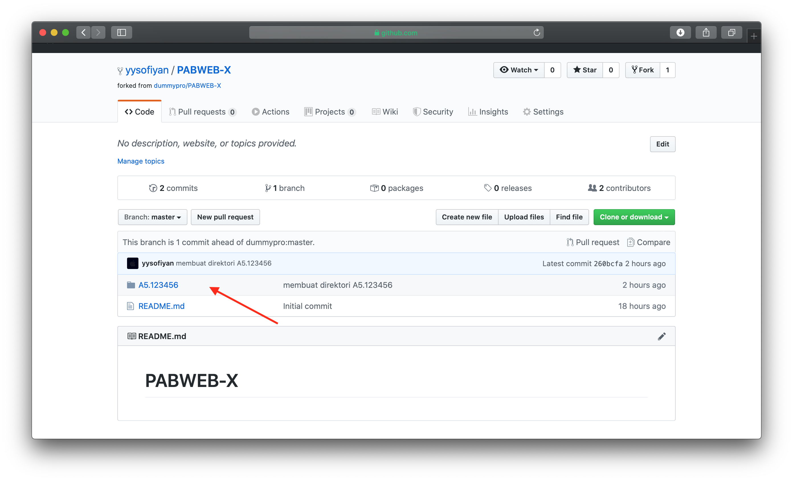

Kalau berhasil, silahkan lanjutkan ke langkah berikutnya.

### Membuat Pull Request
---
`Pull Request` adalah istilah yang bisa kita artikan sebagai permintaan untuk menggabungkan kode.

Kita sudah membuat perubahan di `repository hasil fork`, lalu ingin menggabungkan dengan `repository sumber.`

Maka kita harus membuat `Pull Request.`

Silahkan klik tombol `New Pull Request pada repository`

`cek / compare` perubahan apa yang telah anda lakukan di `branch anda` pada `branch master milik repo pusat`,

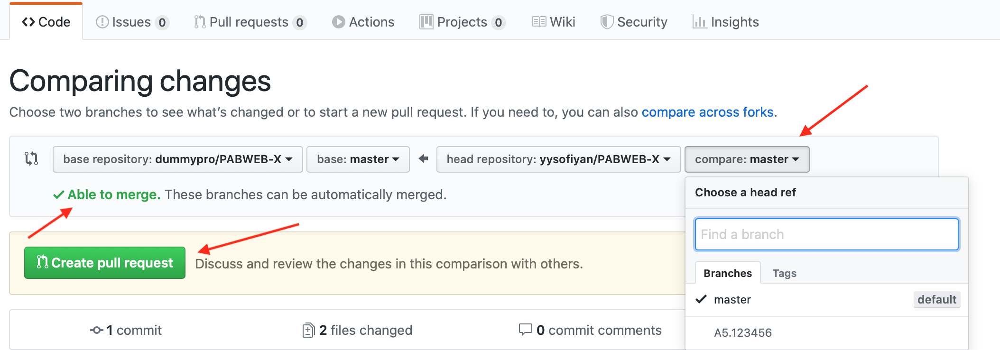

dan anda juga bisa `menyisipkan pesan` untuk memberitahukan `developer pemilik repo pusat` tentang apa yang anda lakukan, setelah yakin terhadap perubahan yang telah anda lakukan silahkan pilih `create pull request`

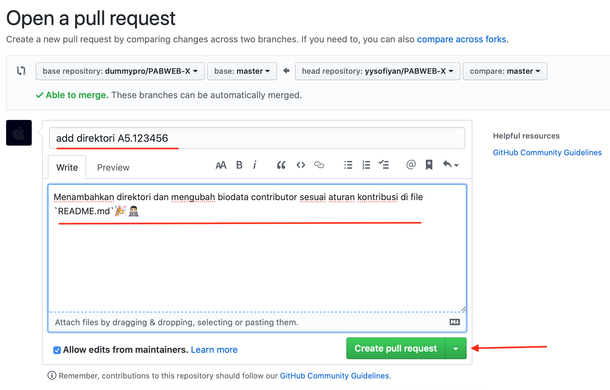

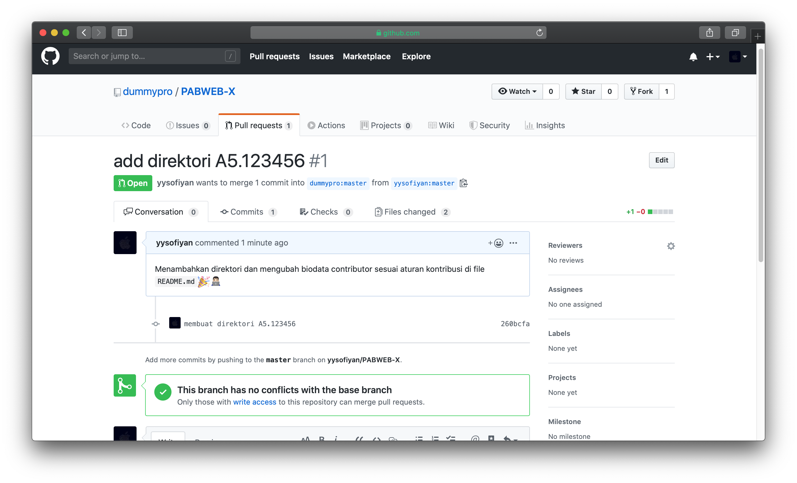

Hooray!🎉Anda telah membuat kontribusi! anda tinggal menunggu pemilik repo pusat untuk menanggapi di terima tidaknya kontribusi anda. 

### Setelah Pull Request Diterima
---
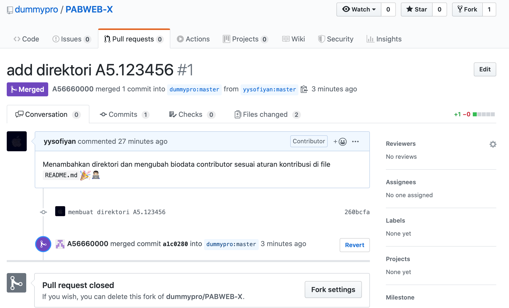

Horee …. 🥳🎉 Pull request kita diterima, biasanya akan ada tulisan *Merged* berwarna ungu. Selanjutnya apa yang kita lakukan?

Bila pull request kita diterima, harusnya perubahan yang kita lakukan sudah ada di `upstream`. Coba kita lihat dulu.

```git
git checkout master
git pull
```
outpunya seperti ini

```git
➜  PABWEB-X (master) ✔ git pull 
Already up to date. 
```

Kondisi `master` kita sudah **up to date** dengan `upstream`. Sekarang lihat daftar perubahannya dengan perintah 

```git
git log --oneline
```


Karena perubahan kita sudah terkandung dalam `upstream`, kita bisa menghapus `topic branch` kita tadi.

```git
git branch -D A5.123456
```
Hapus juga yang ada di Github

```git
git push origin :A5.123456
```


Artinya, push **NULL** ke **origin** untuk menggantikan **A5.123456**, atau bahasa gampangnya **HAPUS**

### Referensi
---
1. [nvie.com](https://nvie.com/posts/a-successful-git-branching-model/)
2. [try.github.io](https://try.github.io)